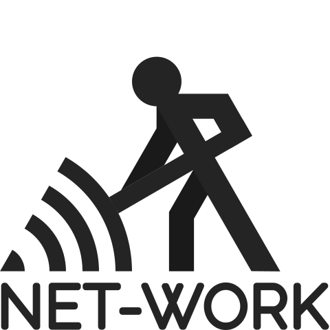
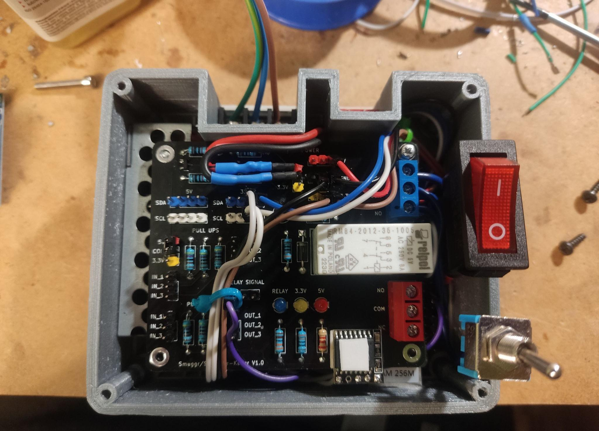
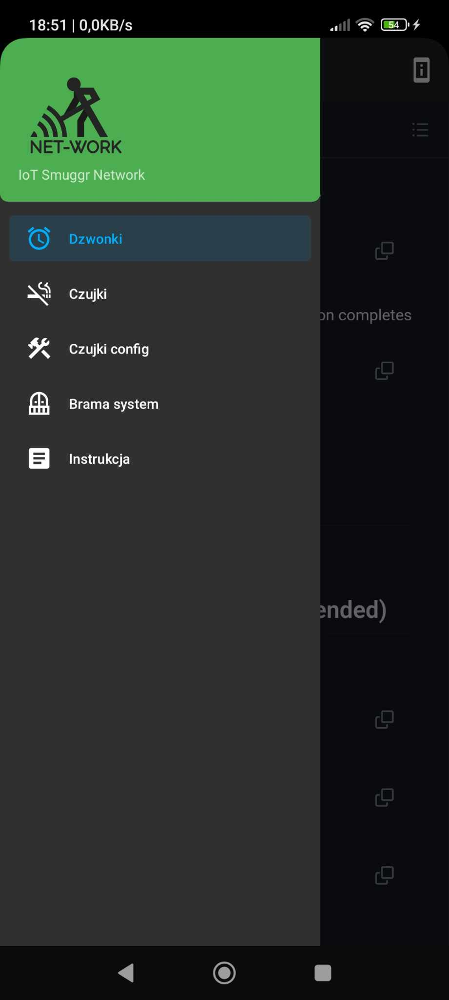

<!-- markdownlint-disable MD033 -->
<!-- markdownlint-disable MD041 -->

  

    <h1>Dokumentacja techniczna projektu</h1>
    <h2 class="title-text">"Smuggr Net-Work"</h2>
    
  

 
 
 

  

    <h2 class="title-text"><strong>Autorzy:</strong></h2>
    <h2>Karol Duda</h2>
    <h2>Dawid Głąb</h2>
     
     
     
     
     
  

 
 
 
 
 

  

    
  

  

    
  

  

    
  

  

    <h2>Zespół Szkół Elektryczno-Mechanicznych nr. 7 w Nowym Sączu</h2>
  

# Spis Treści <!-- omit in toc -->

[1. Wstęp](#1-wstęp)
[2. Cele i założenia](#2-cele-i-założenia)
[3. Przebieg pracy](#3-przebieg-pracy)
[4. Część informatyczna](#4-część-informatyczna)
-- [4.1. Backend - strona serwerowa](#41-backend---strona-serwerowa)
-- [4.2. Frontend - strona użytkownika](#42-frontend---strona-użytkownika)
-- [4.3. Działanie aplikacji](#43-działanie-aplikacji)
-- [4.4. Wygląd aplikacji](#44-wygląd-aplikacji)
[5. Część mechatroniczna - sterownik](#5-część-mechatroniczna---sterownik)
-- [5.1. Prototyp sterownika](#51-prototyp-sterownika)
-- [5.2. Gotowy produkt - sprzęt](#52-gotowy-produkt---sprzęt)
-- [5.3. Gotowy produkt - program](#53-gotowy-produkt---program)
[6. Część mechatroniczna - czujki dymu](#6-część-mechatroniczna---czujki-dymu)
-- [6.1. Gotowy produkt - sprzęt](#61-gotowy-produkt---sprzęt)
-- [6.2. Gotowy produkt - aplikacja](#62-gotowy-produkt---aplikacja)
[7. Kosztorys](#7-kosztorys)
[8. Zalety i korzyści](#8-zalety-i-korzyści)
[9. Konkurencyjność](#9-konkurencyjność)
[10. Innowacyjność](#10-innowacyjność)
[11. Plany na przyszłość](#11-plany-na-przyszłość)
[12. Gdzie nas można znaleźć](#12-gdzie-nas-można-znaleźć)

## 1. Wstęp

Obecny świat daje nam mnóstwo możliwości rozwoju, dostępu do wiedzy, techniki, swobody i udogodnień życiowych, co niesie za sobą również ogromne tempo życia. Wynika z tego nieodparta potrzeba unowocześniania naszej codzienności, stwarzania jej bardziej punktualną, bezpieczną, wygodniejszą i pomocną w codziennych czynnościach, a także dbającą o nasze bezpieczeństwo i cenny czas:

*"Czas jest darmowy, ale jest bezcenny. Nie możesz go posiąść, ale możesz go wykorzystać. Nie możesz go zatrzymać, ale możesz go na coś poświęcić. Raz stracony nie może być nigdy odzyskany." –  **Harvey MacKay***

Dlatego postanowiliśmy zaprojektować i stworzyć możliwie uniwersalny system pozwalający za pomocą sieci **Wi-Fi** czy **LAN** łączyć różnego rodzaju nasze urządzenia jak na przykład: czujniki palenia, sterownik dzwonków szkolnych, otwieranie bramy przez sczytywanie tablic rejestracyjnych, itp.

Aktualnie głównym zadaniem systemu jest obsługa inteligentnego sterownika dzwonków szkolnych oraz zbieraniu i przetwarzaniu danych z czujników palenia papierosów.

Właściciel systemu może na bieżąco kontrolować czujniki/sterowniki na całym obiekcie po przez aplikacje webową czy aplikacje mobilną z każdego miejsca na świecie.

## 2. Cele i założenia

1. Dbanie o punktualność dzwonków szkolnych.
2. Stworzenie kompaktowych urządzeń IoT połączonych poprzez jeden system.
3. Pomoc w egzekwowaniu zakazów palenia, na przykład: w placówkach szkolnych czy hotelach.
4. Stworzenie systemu o praktycznie niekończących się możliwościach rozwoju.
5. Wygodne sterowanie za pomocą internetu lub telefonu (aplikacji).
6. Prostych w obsłudze i konfiguracji.

System **Smuggr *Net-Work*** ma trafiać przede wszystkim do miejsc, w których cenione jest przestrzeganie zakazów palenia na przykład szkół, gdzie staramy się zwrócić szczególną uwagę na zdrowie młodocianych uczniów, a także w tych palcówkach oświaty unowocześnić stare sterowniki dzwonków, które dzwonią w swoim rytmie. Jak również do wszystkich ceniących porządek i przydatne nowinki techniczne.

Jednak z założenia system jest uniwersalny, to znaczy, że również sprawdzi się w szpitalach, budynkach publicznych, czy pokojach hotelowych. **Smuggr *Net-Work*** może pracować bez przerwy, a do jego pracy wystarczy dostęp do sieci internetowej oraz zasilanie. Podczas tworzenia **Smuggr *Net-Work*** mieliśmy na uwadze również uniwersalność systemu pod względem zadań jakie może realizować. Fizyczna struktura systemu umożliwia łatwy montaż urządzeń pracujących w naszym projekcie. Nasze urządzenia nadają się do współpracy z innymi urządzeniami, na przykład: czujki do sieci **Wi-Fi** znajdującej się w obiekcie, sterownik dzwonków **Schedule-Keepr** - łatwo podpiąć do istniejącej instalacji.
Przez cały okres tworzenia **Smuggr *Net-Work*** zwracaliśmy również uwagę na fakt, aby urządzenia były proste i nie generowały dużych kosztów utrzymania co jest ich ogromną zaletą. Postawiliśmy na podzespoły o wysokiej sprawności energetycznej oraz postaraliśmy się o zminimalizowanie zużycia energii dzięki temu urządzenia są ekologiczne.

## 3. Przebieg pracy

Pracę nad projektem rozpoczęliśmy na początku października 2023 roku. Natomiast pomysł powstał wcześniej – bo na początku września 2023 roku.

Pomysł narodził się w momencie, kiedy po raz kolejny dzwonek w naszej szkole nie został przestawiony na skrócone lekcje i do tego spóźniał się o ***ponad dwie minuty***. Postanowiliśmy to zmienić i stworzyć sterownik dzwonków, który sam na podstawie planu lekcji ustawia godziny, o których dzwoni oraz przez cały okres eksploatacji jest punktualny co do sekundy. Chcieliśmy też, aby była możliwość zarządzania nim przez internet, czy zamiast uruchamiania klasycznych dzwonków mógł opcjonalnie przy pomocy węzła radiowego w szkole, odgrywać różne dźwięki w tym inny na przerwę oraz inny na lekcje. Parę dni później dowiedzieliśmy się o nowym problemie, który zaczął się pojawiać, chodzi o nieprzestrzeganiu przez uczniów zakazu palenia e-papierosów na terenie placówki w toaletach. Co spowodowało, że postanowiliśmy zrobić uniwersalny system, który może połączyć zarządzanie czujkami oraz sterownikiem dzwonków, a w przyszłości kolejnych urządzeń takich jak, na przyklad później wspomniany: sterownik bramy, itd.

Prace rozpoczęliśmy od zaprojektowania i wykonania prototypu sterownika dzwonków później powstał **serwer REST i broker MQTT**. Następnie zajęliśmy się stworzeniem czujników palenia i połączeniem tego w całość mając cały czas na uwadze, że w przyszłości będziemy chcieli dodawać kolejne urządzenia do naszego systemu, przez co musiał on być prosty w rozbudowie o następne elementy. W między czasie powstawała aplikacja mobilna na telefony, które są oparte o system android pozwalająca przeprowadzić pierwszą konfiguracje czujników oraz zawierająca pozostałe funkcje, które zawierała aplikacja internetowa.

Najwięcej czasu poświeciliśmy na dopracowanie poszczególnych elementów systemu takich jak, na przykład: usunięcie wszelkich fałszywych alarmów generowanych przez czujki podczas fazy testów.

## 4. Część informatyczna

Jedną z najważniejszych zalet **Net-Worku** jest jego infrastruktura informatyczna. W celu zbudowania funkcjonującego systemu wykorzystane zostały najnowsze frameworki oraz języki programowania. Samo oprogramowanie zostało napisane w kilku językach, strona serwerowa została napisana w języku ***Go***, natomiast strona użytkownika została napisana w języku ***JavaScript*** wraz z frameworkiem ***Vue.js*** i komponentami w najnowszym standardzie material, ***Vuetify***, do automatyzacji kompilacji i uruchamiania oprogramowania został wykorzystany ***Make*** oraz ***Bash***.

Komunikacja w oprogramowaniu opiera się na protokołach ***Message Queuing Telemetry Transport*** **(MQTT) w wersji 3.11** oraz ***Represantional State Transfer*** **(REST)**, oba protokoły są przydatne w różnych kontekstach komunikacyjnych. Protokół **MQTT** został wykorzystany ze względu na jego lekkość i efektywność, co czyni go idealnym rozwiązaniem dla aplikacji związanych z **Internetem Rzeczy (IoT)** oraz systemów o niskich wymaganiach zasobowych. Dzięki modelowi publikacji i subskrypcji **(PUBSUB)**, **MQTT** umożliwia efektywną wymianę danych między urządzeniami w czasie rzeczywistym. Z kolei architektura **REST** stanowi uniwersalny interfejs komunikacyjny, który pozwala na zarządzanie zasobami w sposób zrozumiały dla ludzi oraz maszyn. Wykorzystanie tych protokołów pozwala na elastyczne i skalowalne budowanie aplikacji, które są w stanie efektywnie komunikować się z różnymi systemami i urządzeniami.

## 4.1. Backend - strona serwerowa

W celu zbudowania bezpiecznego oraz wydajnego serwera **REST** i brokera **MQTT**, wykorzystane zostały następujące pakiety języka **Go**:

- ***GIN* 1.9.1**
- ***COMQTT* 2.5.4**

Technologie te pozwalają na bezpośrednią integracje obu protokołów komunikacyjnych w jednej bazie kodu. W przypadku pakietu **GIN** dodatkowe możliwości wprowadzania **middleware'ów** (programów pośrednich między żądaniem a właściwą częścią aplikacji) pozwoliły na proste wbudowanie dodatkowych zabezpieczeń dostępu do serwera **REST**, takich jak:

- **Ograniczenie szybkości zapytań (Rate Limiting)** które jak sama nazwa wskazuje zmniejsza częstotliwość odpowiedzi na zapytania pochodzących od jednego klienta w określonym przedziale czasowym, co może pomóc w zapobieganiu nadmiernemu obciążeniu serwera.

- **Tokeny JWT (Json Web Token)** które stanowią sposób na uwierzytelnianie i autoryzację użytkowników w serwerze **REST**. **JWT** są tokenami zawierającymi informacje o użytkowniku oraz jego uprawnieniach, podpisane przez serwer, co pozwala na bezpieczne przesyłanie tych danych między klientem a serwerem. Dzięki nim można łatwo kontrolować dostęp do zasobów oraz identyfikować użytkowników w systemie.

Natomiast pakiet **COMQTT** zapewnia nie tylko implementację protokołu **MQTT**, ale również możliwość bezpośredniego konfigurowania, monitorowania oraz ingerencji w broker **MQTT**. Dzięki temu można skonfigurować różne parametry działania brokera w sposób programowy, takie jak na przykład maksymalny rozmiar wiadomości czy maksymalna liczba połączonych klientów, a także monitorować jego wydajność i obciążenie. Ważną kwestią jest też możliwość uwierzetelniania klientów którzy próbują połączyć się z brokerem, realizowane jest to poprzez pozyskiwanie danych na temat klientów z bazy danych oraz porównywanie danych z którymi dany klient próbuje się połączyć. W wyniku tego można zapewnić bezpieczne i kontrolowane połączenia między klientami a brokerem **MQTT**.

Dzięki wykorzystaniu tych pakietów możliwe było zrealizowanie nie tylko bezpiecznego, ale także wydajnego serwera **REST** oraz brokera **MQTT**, który spełnia wymagania zarówno pod kątem funkcjonalności, jak i wydajności.

Ważną rzeczą w naszym oprogramowaniu jest również integracja z relacyjną **bazą danych *PostgreSQL***, aplikacja wykorzystuje ją aby przetrzymywać lub odczytywać dane na temat zarejestrowanych użytkowników, urządzeń, konfiguracji urządzeń czy wtyczek. Ingerować w nią mogą zarejestrowani użytkownicy posiadający odpowiedni poziom uprawnień.

Dodawanie i obsługa urządzeń opiera się na wcześniej wspomnianych ***wtyczkach***. Są one implementacjami programowymi, które mogą być dynamicznie załadowane do głównego projektu jako moduły zewnętrzne lub statycznie, bezpośrednio przy kompilacji głównego programu. Funkcjonalność taką umożliwia wbudowany do języka **Go**, pakiet **Plugin**. Wtyczki te są kompilowane do plików typu ***.so* (Shared Object)** (odpowiednik plików DLL tylko że dla systemów na bazie UNIX'a), umożliwiając ich dynamiczne ładowanie i wykonanie w kontekście głównej aplikacji. Dzięki temu rozwiązaniu możliwe jest rozszerzanie funkcjonalności ***Net-Worku*** poprzez dodawanie nowych wtyczek bez konieczności modyfikacji kodu głównego programu. Wtyczki te stanowią modularne rozszerzenia aplikacji, co pozwala na elastyczne dostosowywanie i rozbudowywanie systemu w zależności od potrzeb użytkowników.

Wtyczki muszą posiadać zarówno stronę serwerową jak i stronę użytkownika, strona serwerowa wykorzystywana jest do komunikacji instancji wtyczki z urządzeniem któremu została przypisana. Odbywa się to poprzez interfejs ***API* (Application Programming Interface)** udostępniony przez wtyczkę, który umożliwia komunikację, poprzez różne protokoły komunikacyjne, z głównym systemem sterowania oraz obsługę żądań związanych z danym urządzeniem.

Z kolei strona użytkownika wtyczki dostarcza interfejs graficzny, który umożliwia użytkownikowi konfigurację oraz monitorowanie działania danego urządzenia. Jest to miejsce, w którym użytkownik może na przykład zarządzać ustawieniami, przeglądać historię działania urządzenia, oraz podejmować różne akcje w zależności od funkcjonalności wtyczki i urządzenia. W ten sposób wtyczki pełnią kluczową rolę w zapewnieniu interakcji pomiędzy użytkownikiem a systemem sterowania, umożliwiając zarówno monitorowanie, jak i zarządzanie podłączonymi urządzeniami.

Wtyczki mogą mieć dowolną funkcjonalnosć dostosowaną do wymogów konkretnego urządzenia lub systemu, co umożliwia elastyczne dostosowanie ich do różnorodnych zastosowań. W ten sposób, dzięki wtyczkom, użytkownik może rozbudowywać funkcjonalność systemu sterowania zgodnie z własnymi potrzebami.

Dodatkowe narzędzia i paczki użyte przy tworzeniu i testowaniu strony serwerowej:

- Curl
- Postman
- MQTT Explorer
- PostgreSQL Explorer

 

Otwarto źródłowe pakiety języka **Go**:

- charmbracelet/lipgloss
- didip/tollbooth
- gin-contrib/cors
- gin-gonic/gin
- golang-jwt/jwt/v5
- hashicorp/mdns
- joho/godotenv
- spf13/viper
- golang.org/x/crypto
- gorm.io/gorm

<!-- Dodać tutaj dokumentacje API ze Swaggera -->

## 4.2. Frontend - strona użytkownika

Aplikacja internetowa w całości oparta została na frameworku ***Vue.js* 3**. Dzięki zastosowaniu tej technologii aplikacja pod względem wydajnościowym wyraźnie wyprzedza inne projekty, które z domysłu oparte są o statyczne strony internetowe.

Aplikacja internetowa oparta jest na nowoczesnych technologiach takich jak framework ***Vue.js* 3**, ***Vite* 5.2.2** jako narzędzie do budowania projektu w jedna spójną całość gotową do uruchomienia, oraz ***Vuetify***, biblioteki komponentów **Material Design**. W połączeniu z biblioteką ***Pinia* 2.1.7** do zarządzania stanem aplikacji oraz ***Axios* 1.6.7** do komunikacji z serwerem, te technologie pozwoliły nam na stworzenie wyjątkowo wydajnej aplikacji jednostronowej **SPA (Single Page Application)**. **Vue.js** umożliwia dynamiczne routowanie po stronie użytkownika, eliminując jednocześnie konieczność przeładowywania całej strony podczas przejść miedzy różnymi widokami, co poprawia doświadczenie i komfort użytkownika. **Pinia** wraz z **Axios** zapewniają bezpieczną i wydajną komunikację z serwerem, a wykorzystanie komponentów z **Vuetify** ułatwiło stworzenie interfejsu użytkownika zgodnego ze standardem **Material Design**. Dzięki temu, architektura kodu aplikacji staje się bardziej przejrzysta i skalowalna, co znacznie ułatwia rozwój aplikacji o nowe funkcjonalności.

  

    <h3>Przykładowy komponent</h3>
    
  

  

    <h3>Struktura plików frontendu</h3>
    
  

## 4.3. Działanie aplikacji

Głównymi zadaniami naszego oprogramowania ***Net-Work*** jest przedewszystkim łączenie urządzeń w jednym miejscu i umożliwienie niekoniecznie technologicznie zaawansowanym użytkownikom korzystanie z tych urządzeń. Urządzenia mogą łączyć się z **brokerem MQTT** na kilka sposobów:

1. Poprzez emitowany przez oprogramowanie **serwis *MDNS***, który umożliwia proste "otrzymanie" adresu IP brokera w sieci lokalnej i połączenie się z nim. Użytkownik musi pozyskać niezbędne dane urządzenia poprzez skorzystanie z dostępnego interfejsu (na przykład wyświetlacza LCD), gdzie prezentowane są wygenerowane dane potrzebne do utworzenia połączenia, takie jak nazwa klienta **MQTT**, nazwa użytkownika i hasło. Dzięki temu prostemu mechanizmowi użytkownik może szybko i łatwo skonfigurować urządzenia do pracy w sieci **MQTT** bez konieczności ręcznego wprowadzania adresu IP brokera czy innych szczegółowych ustawień sieciowych.

2. Poprzez manualne skonfigurowanie adresu IP brokera **MQTT** w ustawieniach urządzenia. Ten sposób wymaga od użytkownika znajomości adresu IP oraz innych szczegółowych parametrów sieciowych brokera i urządzenia. Po uzyskaniu tych informacji użytkownik musi ręcznie wprowadzić je do urządzenia na przykład poprzez ***SSH* (Secure Shell)**, co może być bardziej skomplikowane dla osób mniej zaznajomionych z technicznymi aspektami sieci komputerowych. Jednakże, dla bardziej zaawansowanych użytkowników, ten sposób może być preferowany ze względu na większą kontrolę nad konfiguracją sieciową urządzenia.

## 4.4. Wygląd aplikacji

  

    <h3>Strona główna przed zalogowaniem</h3>
    
  

  

    <h3>Okno logowania</h3>
    
  

  

    <h3>Demonstracja weryfikacji danych</h3>
    
  

  

    <h3>Strona główna po zalogowaniu</h3>
    
  

  

    <h3>Profil zalogowanego użytkownika</h3>
    
  

  

    <h3>Strona "O stronie"</h3>
    
  

  

    <h3>Panel z urządzeniami</h3>
    
  

## 5. Część mechatroniczna - sterownik

Naszym projektem nie jest jedynie oprogramowanie, należy do niego również nasz sterownik ***Schedule-Keepr* 1.0** który jest jednocześnie pierwszym urządzeniem funkcjonującym w naszym systemie. Jego zadaniem jest automatyzowanie funkcji aktywacji (w odpowiednim przedziale czasowym lub na żądanie) dzwonków lub jakiegokolwiek innego peryferium które może być sterowane wyjściem przekaźnikowym.

## 5.1. Prototyp sterownika

  

    <h3>Prototyp PCB</h3>
    
  

  

    <h3>1. Przekaźnik mechaniczy wraz z układem sterowania</h3>
    <h3>2. Konwerter poziomów logicznych</h3>
    <h3>3. Zasilanie 5V oraz 3.3V</h3>
    <h3>4. Linie I2C o napięciu logicznym 5V oraz 3.3V</h3>
    <h3>5. Złącza śrubowe przekaźnika</h3>
  

  

    <h3>Dół zlutowanego prototypu</h3>
    
  

  

    <h3>Opis tymczasowego złożenia elementów</h3>
    
  

  

    <h3>1. Prototyp PCB</h3>
    <h3>2. Raspberry Pi Zero W 2</h3>
    <h3>3. Wyświetlacz LCD</h3>
  

W protopie naszego sterownika zdecydowaliśmy się tymczasowo zastosować popularny komputer jednopłytkowy Raspberry Pi zero W 2,
stanowił on jednostkę centralną która wykonywała dedykowany program. Dodatkowo, wykorzystaliśmy wyświetlacz LCD, który umożliwiał intuicyjne wyświetlanie informacji użytkownikowi oraz poprawiał interakcję z naszym systemem. Prototyp, jak widać na załączonym zdjęciu, nie posiadał na początku żadnej obudowy.

## 5.2. Gotowy produkt - sprzęt

Jeżeli chodzi o jednostkę centralną tym razem wykorzystaliśmy NanoPi Neo 1.4, która została wybrana ze względu na jej kompaktowy rozmiar, niskie zużycie energii (i również łatwa dostępność) oraz wystarczającą moc obliczeniową do realizacji zadań z zakresu sterowania i komunikacji w naszym systemie. Ma zainstalowany system **Debian 12** co zapewnia stabilność oraz wsparcie dla szerokiego zakresu aplikacji i narzędzi programistycznych, co jest kluczowe dla efektywnej pracy naszego oprogramowania.

  

    <h3>Komputer jednopłytkowy Nano Pi Neo 1.4</h3>
    
  

Jako urządzenie wyjściowe został zastosowany wyświetlacz **LCD *HD44780* (16x02)** wraz z konwerterem **I2C *PCF8574***, co umożliwia łatwe i wygodne wyświetlanie informacji użytkownikowi. Dzięki konwerterowi I2C, komunikacja z wyświetlaczem jest uproszczona, co znacząco ułatwia integrację tego komponentu z resztą systemu.

  

    <h3>Wyświetlacz LCD HD44780 wraz z konwerterem I2C PCF8574</h3>
    
  

Głównym zadaniem naszego sterownika jest zapewnienie dokładnego pomiaru czasu. Do tego celu wykorzystaliśmy moduł czasu rzeczywistego **(RTC) *DS3231***, który oferuje nie tylko wysoką precyzję zegara, ale ma także wbudowaną funkcje kompensacji zegara względem temperatury. Dzięki temu urządzenie utrzymuje dokładność pomiaru nawet w warunkach zmiennej temperatury otoczenia. Dodatkowo, moduł **DS3231** cechuje się niskim zużyciem energii, co przekłada się na długą żywotność baterii. Te zalety, wraz z prostym interfejsem komunikacyjnym i tym, że jednostka centralna nie musi synchronizować czasu z **serwera NTP** po każdej utracie zasilania, czynią go idealnym dla nas rozwiązaniem.

  

    <h3>Zegar czasu rzeczywistego DS3231</h3>
    
  

W gotowym produkcie zamiast płytki stykowej lub perforowanej - przydatnych w pierwszych fazach budowy i testowania sterownika - została stworzona dedykowana płytka PCB, którą stosuje się praktycznie we wszystkich profesjonalnych urządzeniach elektronicznych. Wynika to między innymi z tego że płytki PCB świetnie nadają się do tworzenia dowolnych układów elektronicznych o dowolnej złożoności.

  

    <h3>PCB od razu po rozpakowaniu</h3>
    
  

Do zaprojektowania schematu jak i układu płytki PCB sterownika wykorzystany został program ***KiCad* 6.0.2**, jest to bardzo popularny wybór wśród entuzjastów elektroniki jak i profesjonalistów. Program ten oferuje zaawansowane narzędzia do projektowania schematów i układów PCB, co pozwoliło efektywnie stworzyć projekt sterownika. Jego popularność wynika z tego, że jest darmowy i otwarto źródłowy, co czyni go dostępnym dla szerokiego grona użytkowników.

*Zamówienie wyprodukowania płytek (10 sztuk) zostało złożone na stronie **PCBWay**.*

  

    <h3>Zamówione płytki tuż po zrealizowaniu</h3>
    
  

  

    <h3>Układ elementów PCB</h3>
    
  

  

    <h3>Wizualizacja 3D</h3>
    
    
  

  

    <h3>Gotowe PCB</h3>
    
    
  

  

    <h3>Opis złożenia elementów</h3>
    
  

  

    <h3>1. Wejście i wyjścia zasilające 5V i 3.3V</h3>
    <h3>2. Złącza śrubowe przekaźnika</h3>
    <h3>3. Przekaźnik wraz z układem sterowania</h3>
    <h3>4. Wskaźniki LED stanu przekaźnika oraz obecności zasilania</h3>
    <h3>5. Wejścia i wyjścia wraz z rezystorami podciągającymi w górę lub w dół</h3>
    <h3>6. Linie I2C o napięciu logicznym 5V oraz 3.3V</h3>
  

  

    <h3>Schemat elektroniczny</h3>
    
  

Na tej płytce znajdują się 2 wyjścia śrubowe od przekaźnika (nr. 2), które są używane do przesterowywania podłączonych do nich urządzeń. Dodatkowo, umieszczone zostały wskaźniki LED (nr. 4) - niebieski wskaźnik informuje o stanie cewki przekaźnika, żółty oznacza zasilanie 3.3V, natomiast czerwony sygnalizuje zasilanie 5V - elementy te nie tylko zapewniają kontrolę nad działaniem urządzenia, ale także umożliwiają szybką diagnostykę stanu pracy sterownika, co przyczynia się do sprawnego monitorowania oraz konserwacji systemu.

  

    <h3>Konwerter poziomów logicznych magistrali I2C</h3>
    
  

Aby zapewnić wszechstronną kompatybilność naszego sterownika z różnorodnymi urządzeniami, zdecydowaliśmy się na wykorzystanie układu (nr. 6) opartego na dwóch tranzystorach ***BSS138* (MOSFET typu N)** oraz czterech rezystorach. Ten układ jest przeznaczony do konwersji poziomów logicznych, co umożliwia skuteczną integrację naszego sterownika z różnymi urządzeniami wykorzystującymi protokół komunikacyjny I2C.

  

    <h3>Rezystory podciągające w górę lub dół</h3>
    
  

Na płytce znalazło się również wiele przydatnych wyprowadzeń, w tym wyprowadzenia z rezystorami podciągającymi w górę lub w dół (nr. 5). Te rezystory są kluczowe dla umożliwienia podpięcia różnych czujników, urządzeń wejściowych (takich jak przełączniki czy guziki) a nawet GPIO komputera jednopłytkowego znajdującego się w środku. Ich obecność zapewnia nie tylko elastyczność w integracji z różnymi układami lub urządzeniami, ale także stabilność sygnałów logicznych, co gwarantuje niezawodną pracę naszego sterownika w różnorodnych warunkach użytkowania.

  

    <h3>Gotowa do wydruku 3D obudowa</h3>
    
    
  

Model obudowy został wykonany w programie **DesignSpark Mechanical**, który pozwolił nam stworzyć precyzyjny projekt z uwzględnieniem wszystkich szczegółów konstrukcyjnych. Starannie zaprojektowaliśmy każdy aspekt obudowy, aby zapewnić nie tylko estetyczny wygląd, ale także ochronę dla wrażliwych podzespołów znajdujących się wewnątrz. Dodatkowo, projektowanie w programie **DesignSpark Mechanical** umożliwiło nam łatwe dostosowanie obudowy do naszych indywidualnych potrzeb oraz szybką iterację w celu wprowadzenia ewentualnych zmian i ulepszeń.

  

    <h3>Ułożenie komponentów wewnątrz obudowy</h3>
    
    
  

  

    <h3>Zamocowany zasilacz i jednostka centralna</h3>
    
  

  

    <h3>Przymiarka sterownika do szafy elektrycznej</h3>
    
  

  

    <h3>Gotowy do uruchomienia sterownik</h3>
    
    
  

  

    <h3>Uruchomiony sterownik</h3>
    
  

## 5.3. Gotowy produkt - program

Dedykowany program do sterownika został napisany w językach programowania ***Go*** oraz ***Bash***, realizuje on zadania z zakresu sterowania przekaźnikiem wbudowanym w płytkę PCB, synchronizacją zapisanego lokalnie harmonogramu przesterowywania przekaźnika oraz czasu **zegara RTC** pobranego z **serwera NTP**, dane na temat tego harmonogramu sterownik pozyskuje poprzez swoją instancje **dedykowanej wtyczki w brokerze MQTT** co pozwala zsynchronizować ten sam harmonogram na wielu urządzeniach na raz. Sam harmonogram po stronie **wtyczki** pobierany jest ze strony naszej szkoły, co umożliwia precyzyjne określenie momentu przełączenia przekaźnika na podstawie ustalonych przedziałów lekcji i przerw.

Skrypty w języku Bash używane są do interakcji z urządzeniami ***/dev/***, takimi jak na przykład urządzenia ***GPIO* (General Purpose Input/Output)** oraz do ustawiania czasu systemowego na podstawie danych z **zegara RTC**. Te skrypty wykonują kluczowe operacje sterowania, w tym przesterowywanie pinów **GPIO** w odpowiednim momencie (określonym z góry przez program w **Go**) oraz synchronizację czasu systemowego z dokładnym czasem dostarczanym przez **RTC**. Dzięki temu zapewniona jest precyzja i niezawodność w działaniu sterownika, a także możliwość zaprogramowania różnych zachowań w zależności od warunków czasowych i sygnałów zewnętrznych.

## 6. Część mechatroniczna - czujki dymu

W naszym projekcie znajduje się także czujka dymu, której głównym zadaniem jest wykrywanie obecności dymu powstałego w wyniku palenia papierosów, używania urządzeń do inhalacji typu: vape, e-papierosy itp. Czujka działa w sposób automatyczny, reagując na wzrost stężenia cząstek stałych w powietrzu powyżej ustalonego progu, który jest wyższy niż poziom występujący na zewnątrz. W momencie wykrycia zanieczyszczenia, czujka aktywuje alarm dźwiękowy oraz wysyła powiadomienie o incydencie do użytkownika poprzez aplikację mobilną.

## 6.1. Gotowy produkt - sprzęt

Model obudowy, podobnie jak sterownik **Schedule-Keepr**, został wykonany w programie **DesignSpark Mechanical**, dzięki temu zapewniamy precyzyjne odwzorowanie wymiarów oraz szczegółów konstrukcyjnych, co gwarantuje doskonałe dopasowanie komponentów oraz estetyczny wygląd całego urządzenia.

  

    <h3>Gotowa do wydruku 3D obudowa</h3>
    
    
  

  

    <h3>Opis złożenia elementów</h3>
    
  

  

    <h3>1. Stabilizator 5V L7805CV</h3>
    <h3>2. Czujnik PMS5003</h3>
    <h3>3. Czujnik krańcowy mini WK612</h3>
    <h3>4. Brzęczyk</h3>
    <h3>5. Przycisk monostabilny</h3>
    <h3>6. Moduł przekaźnika 5V</h3>
    <h3>7. Zasilacz montażowy Akyga 8.5-14V 2A</h3>
    <h3>8. Beetle ESP32 - C3 RISC-V</h3>
  

## 6.2. Gotowy produkt - aplikacja

Dodatkowo, czujka, ciągle przekazuje dane o stężeniu cząstek stałych do serwera, gdzie są archiwizowane i wykorzystywane do generowania wykresów. Przykładowy wykres, na przykładzie danych zebranych z jednej z toalet szkolnych, obrazuje godziny, w których odnotowano wzrost stężenia dymu, co umożliwia analizę trendów oraz podejmowanie działań zapobiegawczych.

*Czerwoną linią na wykresie został zaznaczony próg **aktywacji czujki***

  

    <h3>Wykres wartości odnotowanych w czasie</h3>
    
  

W celu zapewnienia szybkiej reakcji oraz skutecznego działania czujki, konieczne jest dodatkowe wyposażenie w drugą czujkę lub stację pogodową, która dostarcza aktualne informacje o stężeniu zanieczyszczeń w powietrzu, w tym smogu. Ponadto, czujki zostały wyposażone w szereg zabezpieczeń mających na celu zapobieżenie działaniom niepożądanym:

- Czujka wykrywa przypadki, gdy zostaje zablokowana lub zatkana, co skutkuje uruchomieniem alarmu oraz powiadomieniem operatora systemu o incydencie.

- Zakłócenie komunikacji między czujką a systemem również inicjuje alarm, aby szybko zareagować na potencjalne próby manipulacji.

- Próba otwarcia czujki także wywołuje alarm oraz wysyła stosowne powiadomienie, aby zapobiec próbom manipulacji lub uszkodzenia urządzenia.

Początkowa konfiguracja czujki, w tym podłączenie do sieci oraz integracja z systemem, odbywa się za pomocą aplikacji mobilnej. Ponadto, aplikacja umożliwia monitorowanie danych na żywo z poszczególnych czujek, co pozwala na szybką reakcję na zmiany stężenia zanieczyszczeń w powietrzu.

Warto również zaznaczyć, że czujki posiadają zdolność aktualizacji oprogramowania zdalnie, co jest realizowane poprzez mechanizm **Over-The-Air *(OTA)***. Do realizacji tego mechanizmu wykorzystują bibliotekę **ElegantOTA**. Dzięki tej funkcji możliwe jest wprowadzanie zmian w oprogramowaniu bez konieczności fizycznego podłączania się do urządzenia. Ta zaawansowana funkcjonalność umożliwia wygodne i efektywne zarządzanie oprogramowaniem na wielu urządzeniach zainstalowanych w różnych lokalizacjach.

  

    <h3>Konfiguracja dostępu do sieci Wi-Fi przez czujkę</h3>
    
  

  

    <h3>Wskaźniki poziomów zanieczyszczeń poszczególnych czujek</h3>
    
  

  

    <h3>Strona główna aplikacji od czujek</h3>
    
  

  

    <h3>Gotowa do uruchomienia czujka</h3>
    
    
  

## 7. Kosztorys

  

    <h3><strong>Sterownik Schedule-Keepr</strong></h3>
  

  <table>
    <thead>
      <tr>
        <th>Nazwa</th>
        <th>Ilość</th>
        <th>Cena</th>
      </tr>
    </thead>
    <tbody>
      <tr>
        <td>Obudowa Schedule-Keepr</td>
        <td>1</td>
        <td>15 zł</td>
      </tr>
      <tr>
        <td>NanoPi Neo 1.4</td>
        <td>1</td>
        <td>149 zł</td>
      </tr>
      <tr>
        <td>Chłodzenie NanoPi</td>
        <td>1</td>
        <td>9 zł</td>
      </tr>
      <tr>
        <td>Wyświetlacz LCD HD44780</td>
        <td>1</td>
        <td>25 zł</td>
      </tr>
      <tr>
        <td>Zegar RTC DS3231</td>
        <td>1</td>
        <td>31 zł</td>
      </tr>
      <tr>
        <td>Wyłącznik bistabilny</td>
        <td>1</td>
        <td>2 zł</td>
      </tr>
      <tr>
        <td>Wyłącznik kołyskowy bistabilny</td>
        <td>1</td>
        <td>3 zł</td>
      </tr>
      <tr>
        <td>Zasilacz montażowy Mean Well</td>
        <td>1</td>
        <td>42 zł</td>
      </tr>
      <tr>
        <td>Przewody połączeniowe</td>
        <td>1</td>
        <td>6 zł</td>
      </tr>
      <tr>
        <td>Przewód 1 mm^2</td>
        <td>1 mb</td>
        <td>5.50 zł</td>
      </tr>
      <tr>
        <td>Przekaźnik RELPOL</td>
        <td>1</td>
        <td>12.99 zł</td>
      </tr>
      <tr>
        <td>Śrubki, nakrętki, podkładki</td>
        <td>-</td>
        <td>4 zł</td>
      </tr>
      <tr>
        <td>Przewody, rezystory, złącza, diody, tranzystory</td>
        <td>-</td>
        <td>18 zł</td>
      </tr>
    </tbody>
  </table>

 

  

    <h3>Za sterownik Schedule-Keepr razem wychodzi <strong>322.49 zł</strong></h3>
  

  

    <h3><strong>Czujka dymu A-Vape</strong></h3>
  

  <table>
    <thead>
      <tr>
        <th>Nazwa</th>
        <th>Ilość</th>
        <th>Cena</th>
      </tr>
    </thead>
    <tbody>
      <tr>
        <td>Obudowa A-Vape</td>
        <td>1</td>
        <td>12 zł</td>
      </tr>
      <tr>
        <td>Beetle ESP32 - C3 RISC-V</td>
        <td>1</td>
        <td>39.90 zł</td>
      </tr>
      <tr>
        <td>Czujnik krańcowy mini WK616</td>
        <td>1</td>
        <td>2.50 zł</td>
      </tr>
      <tr>
        <td>Stabilizator 5V L7805CV</td>
        <td>1</td>
        <td>2 zł</td>
      </tr>
      <tr>
        <td>Zasilacz montażowy Akyga 8.5-14V 2A</td>
        <td>1</td>
        <td>31 zł</td>
      </tr>
      <tr>
        <td>Przewody połączeniowe</td>
        <td>-</td>
        <td>6 zł</td>
      </tr>
      <tr>
        <td>Kostka elektryczna</td>
        <td>1</td>
        <td>3.50 zł</td>
      </tr>
      <tr>
        <td>Moduł przekaźnika 5V</td>
        <td>1</td>
        <td>8.50 zł</td>
      </tr>
      <tr>
        <td>Brzęczyk</td>
        <td>1</td>
        <td>3 zł</td>
      </tr>
      <tr>
        <td>Przycisk monostabilny</td>
        <td>1</td>
        <td>1 zł</td>
      </tr>
      <tr>
        <td>Czujnik PMS5003</td>
        <td>1</td>
        <td>99 zł</td>
      </tr>
    </tbody>
  </table>

 

  

    <h3>Za czujkę A-Vape razem wychodzi <strong>188.90 zł</strong></h3>
  

## 8. Zalety i korzyści

- Kompaktowe wymiary urządzeń,
- Możliwość montażu w miejsce starego sterownika (spełnia normy szaf elektrycznych)
- Łatwa w użyciu i przejrzysta aplikacja
- Możliwość dostosowania parametrów do swoim potrzeb
- Punktualność i bezobsługowość
- W razie awarii szybkość demontażu obudowy (cztery śrubki)
- W przyszłości możliwość dodania kolejnych urządzeń do systemu
- Cena jest bardzo niska, co stanowi znaczącą korzyść dla klientów, szczególnie tych poszukujących ekonomicznych rozwiązań
- Możliwość ciągłego rozwoju systemu
- **Smuggr *Net-Work*** to *system niezawodny*
- Obsługa systemu jest intuicyjna
- System jest zabezpieczony przed nieautoryzowanym dostępem za pomocą mechanizmów uwierzytelniania i autoryzacji opartych na **tokenach JWT** oraz **listach kontroli dostępu (ACL)**.
- Dbałość o zdrowie osób trzecich

## 9. Konkurencyjność

System cechuje się dużymi możliwościami rozwoju i stosunkowo niską ceną, w odróżnieniu od innych tego typu rozwiązań o znacznie mniejszych możliwościach. Urządzenia nie występują jako jeden system i często ich działanie, na przykład: czujników dymu papierosowego pozostawia sporo do życzenia.

Prosta i funkcjonalna budowa naszych urządzeń pozwala na łatwą i tanią eksploatację, a niewielkie rozmiary umożliwiają stosowanie ich w miejscach gdzie jest go mało. Jego montaż/demontaż jest bardzo prosty i intuicyjny, dzięki specjalnemu uchwytowi na szynę TH czy przykręceniu na kołkach do sufitu (czujki dymu), natomiast próba sabotażu, wyzwala alarm.

Należy zwrócić również uwagę na fakt, iż system nie musi być wykorzystywany tylko w jednym celu, a wręcz posiada wiele możliwości, które w przyszłości mogą pozwolić na znaczne rozszerzania systemu o kolejne urządzenia peryferyjne współpracujące z sobą.

System **Smuggr *Net-Work*** został zaprojektowany i stworzony przez młodych rozwijających się Polskich uczniów. Pozwoliło nam to na poszerzenie swoich umiejętności i daje nam to poczucie rozwoju Polskich wartości.

Ważną kwestią, którą warto podkreślić, jest fakt, że nasz projekt opiera się na zasadach **otwartego oprogramowania (open source software)** oraz **otwartego sprzętu (open source hardware)**. Korzystając z tych zasad, udostępniamy nasz kod źródłowy oraz schematy sprzętowe publicznie, co umożliwia społeczności deweloperów i inżynierów dostęp do naszych rozwiązań. Dzięki temu każdy może zobaczyć, analizować i modyfikować nasze projekty zgodnie z własnymi potrzebami i wymaganiami. Ta otwartość sprzyja współpracy, innowacji i rozwojowi, co przyczynia się do szybszego postępu technologicznego i szerzenia się wiedzy w społeczności.

## 10. Innowacyjność

System jest jedyny w swoim rodzaju, nie znaleźliśmy na rynku drugiego takiego samego projektu. Produkt pozwala na zastosowanie do tego typu zadań (w tym wypadku został przystosowany do czujników palenia i sterownika dzwonka szkolnego i nie tylko), ze względu na to, iż jego struktura została tak przygotowana, aby w prosty sposób dodając wtyczkę można było dodać do niego kolejne urządzenie a co za tym idzie umożliwić wykonywanie mu nowych zadań.

**Smuggr *Net-Work*** nie ma skomplikowanej budowy, jest prosty w obsłudze, każda osoba dodana do systemu jako użytkownik/administrator, będzie potrafiła szybko opanować zarządzanie systemem. Z założenia powinien potrafić obsłużyć go prawie każdy.

Nasz system jest skonstruowany w taki sposób, aby jego działanie było bardzo wydajne, posiada niezbędne funkcje i elementy ułatwiające codzienne funkcjonowanie placówek oświaty, hoteli, itp. w tym na przykład utrzymanie braku dymu w toaletach, czy pokojach hotelowych (dzięki temu zabezpiecza przed uruchomieniem czujek przeciw pożarowych i związanym z tym olbrzymich kosztów) czy poprawne działanie dzwonków.

Należy zwrócić uwagę jeszcze na koszt takiego systemu i urządzeń w nim pracujących: niewielkie gabaryty, niskie koszty zakupu (często podstawowy element decyzji), brak potrzeby robienia skomplikowanej instalacji w budynku (może on być szybko i w prosty sposób wdrażany w danym obiekcie, a co za tym idzie może z niego skorzystać znacznie więcej placówek, które już funkcjonują), prosta konstrukcja (przy tym bezawaryjna) to elementy składające się na chęć zakupu naszego produktu.

**Smuggr *Net-Work*** można podpiąć pod system sieci, w który wyposażony jest aktualnie prawie każdy budynek.
Urządzenie to jest pomocnym, innowacyjnym rozwiązaniem, potrzebnym w niejednej placówce szkolnej. Dyrektor naszej szkoły jak i inne osoby wyraziły pozytywną opinie na temat systemu **Smuggr *Net-Work***. Należy też podkreślić, iż nasz system pracuje już w naszej szkole od pewnego czasu i jest niezawodny. Jest też u progu dodania następnego urządzenia, jakim jest sterownik bramy odczytujący tablice rejestracyjne. Jest to dla nas szansa na rozwiniecie projektu jak i w przyszłości wprowadzeniem go do produkcji.

## 11. Plany na przyszłość

Planujemy w następujący sposób rozwijać system **Smuggr *Net-Work***:

Wykonanie uniwersalnego, zintegrowanego i inteligentnego sterownika bram wjazdowych.
Jednym z planów, który jest już w trakcie wykonania jest stworzenie uniwersalnego sterownika do bram wjazdowych różnego rodzaju, który w oparciu o dwie kamery odpowiednio ustawione będą widziały tablice rejestracyjne pojazdów, a następnie dzięki możliwością **Raspberry Pi 5** odczytane numery zostają porównane z tymi zawartymi w bazie danych, a finalnie otrzymana zgodność otworzy bramę.

Ważne jest dla nas, aby można było podłączyć go do większości gotowych już systemów bramowych jako dodatkowa opcja, dlatego sterownik będzie posiadał przekaźnik, który będzie symulował "przycisk dzwonkowy" który można podłączyć do prawie każdego systemu obecnego na rynku.

Chcemy również, aby oprócz automatycznego otwierania można było to robić przez telefon, stronę WWW czy pilotem. Kolejnym ważnym elementem ma być prostota w zarządzaniu, na przykład: wprowadzanie i usuwanie nowych tablic w aplikacji internetowej, możliwość otworzenia bramy przez aplikację z opcją zapamiętania numerów rejestracyjnych pojazdu,  który znajduje się przed bramą, itp. Należy też wspomnieć, że będzie mógł on wykorzystywać kamery z istniejącego monitoringu  zamontowanie w pobliżu bramy wjazdowej o ile będzie na tyle wyraźny obraz, aby można było odczytać tablicę rejestracyjne.
Ze wstępnych wyliczeń wynika, iż nasze rozwiązanie jest znacznie tańsze od konkurencyjnych.

Wykonanie kolejnego elementu systemu jaki jest licznik wejść i wyjść do danego obiektu/pomieszczenia.
Kolejnym planem jest wykonanie prostego licznika, który możemy podłączyć do sieci i dzięki niemu utworzyć wykres jaki ruch występuje w danych godzinach.

W planach rozwojowych **Smuggr Net-Work** znajduje się integracja inteligentnych zegarów **LED** opracowanych przez naszego kolegę **Piotrka**. Ten projekt jest obecnie w fazie realizacji i ma na celu połączenie inteligentnych zegarów **LED** z naszym systemem **IoT**, **Smuggr Net-Work**. Zegary stworzone przez **Piotrka** stanowią innowacyjne rozwiązanie, które doskonale komplementuje funkcjonalność **Smuggr Net-Work**. Ich integracja z naszym systemem pozwoli na rozszerzenie naszych możliwości oraz wspólne generowanie nowych pomysłów na rozwój systemu i wprowadzenie nowych funkcji oraz urządzeń.

*Oczywiście z upływem czasu i nabyciem doświadczenia odkryjemy kolejne możliwości systemu **IoT** jak i ulepszymy **aktualne**.*

## 12. Gdzie nas można znaleźć

  

    <a href="https://github.com/Smuggr">
      <h4>Organizacja na GitHubie (https://github.com/Smuggr)</h4>
    </a>
  

  

    
  

 
 
 
 

  

    <a href="https://github.com/Smuggr/Net-Work">
      <h4>Repozytorium Net-Worku (https://github.com/Smuggr/Net-Work)</h4>
    </a>
  

  

    
  

 
 
 
 

  

    <a href="https://github.com/Smuggr/Net-Work-Docs">
      <h4>Dokumentacja Net-Worku (https://github.com/Smuggr/Net-Work-Docs)</h4>
    </a>
  

  

    
  

